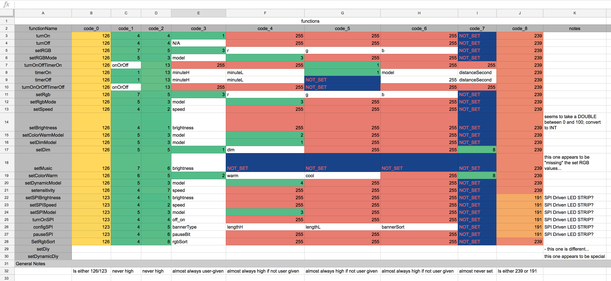
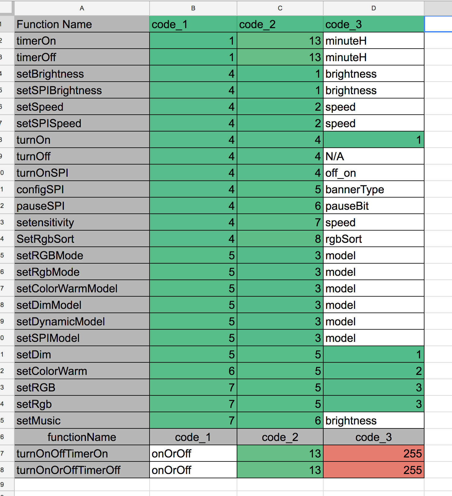

# Magic Numbers

This is not a complete list of reverse engineered functions from the `com.ledble` app, just a small bit of editing and formatting on top of the notes that I put together while I was actively reverse engineering the app/controller.

## TL;DR:

I just found a `.java` file that tells me exactly what bytes to send for every function name, but still have no real idea what each of the 9 bytes does, nor do i know what values are even supported. Furthermore, it appears that most function calls only manipulate a minority of the 9 bytes per packet.

Before trying to reverse engineer how the various UI elements called the various functions, i tried to see if there were any discernible patterns visually.

### Visual analysis

In a semi-successful attempt to understand what functions did what, I made a small spreadsheet to keep track of what bytes changed or stayed the same between function calls:

#### key findings:

* A few of the function names seem to indicate that the firmware on the Controller may also be  used  with some sort of SPI driven device. Perhaps a[clever way of driving neopixels](https://hackaday.com/2014/09/10/driving-ws2812b-pixels-with-dma-based-spi/)?
* ignoring the `SPI` related functions, almost every other function shares a common pattern / structure in bytes. 
	* Every payload is nearly identical and the resolution on most parameters look like un-signed 8 bit in traditional endianness.
	* The `0x0` byte is always equal to `126` and the `0x8`th byte is always `239`. All of a sudden, I only have to figure out what  7 bytes represent, not 9!
	* The `0x7`th byte is almost never set; only for `timer*` or `dimmer*` related functions.  I can't tell if this is because the value does not matter or it’s just never set explicitly, and a default value is compiled in. Either way, I will save my self the trouble and stick to figuring out the absolute minimum needed to get an arbitrary color displaying. I’ll do everything else I need in an environment with documentation…
	
* The `0x1` and `0x02` byte appears to be some sort of numbered command group. For all commands in the `timer*` domain, the value is `0x01`, `0x05` for telling the controller what hardware it’s attached to… etc.

## Magic Numbers

### A few notes

1.  The string `NOT_SET` is for a byte value that is never assigned after the byte array is created. I believe this is because the default value the JVM assigns to the byte never needs modification.

2. There are various controller modes. Sound reactive, timers, pre-programed sequences and colors...etc.

3. This particular controller seems to allow the user to configure which PWM channel will be associated with the  `R`, `G`, `B` labels. This allows any hardware channel to be associated with any color label. This means the software only needs to send color info in one format (R,G,B) and it does not matter if the blue channel is actually the first channel on the actual controller. This is probably done to make manufacturing easier/cheaper.

### `turnOn`:

1. turns strip on, only if in the RGB MODE
2. keeps last brightness setting

#### Inputs:

- none

#### Bytes:
| Byte | Value     |
| ---- | --------- |
| 0x0  | 126       |
| 0x1  | 4         |
| 0x2  | 4         |
| 0x3  | 1         |
| 0x4  | 255       |
| 0x5  | 255       |
| 0x6  | 255       |
| 0x7  | `NOT_SET` |
| 0x8  | 239       |

### `turnOff`:

1. identical to [`turnOn`](#turn-on), but turns the LED strip off.

#### Inputs:
- none

#### Bytes:

| Byte | Value     |
| ---- | --------- |
| 0x0  | 126       |
| 0x1  | 4         |
| 0x2  | 4         |
| 0x3  | `NOT_SET` |
| 0x4  | 255       |
| 0x5  | 255       |
| 0x6  | 255       |
| 0x7  | `NOT_SET` |
| 0x8  | 239       |

### `setRGB`:

- takes three 8 bit unsigned integers and scales the output of the red green or blue channel proportionally from `0x00` (100% off) to `0xff` (100% on).
- not clear if brightness is linear or not
    
#### Inputs:
- `r` - the red value 
- `g` - the green value
- `b` - the blue value

#### Bytes:
| Byte | Value |
| ---- | ----- |
| 0x0  | 126   |
| 0x1  | 7     |
| 0x2  | 5     |
| 0x3  | 3     |
| 0x4  | `r`   |
| 0x5  | `g`   |
| 0x6  | `b`   |
| 0x8  | 239   |

### `setRGBMode`:

- Appears to be a toggle between RGB, macros, music ...etc
    
#### Inputs:
- `model` - not sure what the possible values are

#### Bytes:
| Byte | Value   |
| ---- | ------- |
| 0x0  | 126     |
| 0x1  | 5       |
| 0x2  | 3       |
| 0x3  | `model` |
| 0x4  | 3       |
| 0x5  | 255     |
| 0x6  | 255     |
| 0x8  | 239     |

### `setRgbMode`:

- This appears to be a duplicate of [[setRGBMode]]. 

**NOTE**: I never bothered going through the full app source code to determine which is called and when.

### `SetRgbSort`:

- appears to allow you to change which PWM channel belongs to which color.

#### Inputs:
- `rgbSort` - can be one of :

| Label | rgbSort |
| ----- | ------- |
| RGB   | 1       |
| RBG   | 2       |
| GRB   | 3       |
| GBR   | 4       |
| BRG   | 5       |
| BGR   | 6       |

Example:

1. A value of `1` would map `R` to 1st channel, G to 2nd channel, B to 3rd channel
2. A value of `1` would map `B` to 1st channel, G to 2nd channel, R to 3rd channel

**NOTE**: I have not spent a *lot* of time playing with theses. Some values seem to have an effect on my strips, others do not. Some amazon reviewers say that the colors are swapped around, I think this might be to make manufacturing easier (does not matter which order the workers solder LED strip connector wires to the PCB; fix it in software, later) or to work with whichever RGB LED strip is cheapest that day, irrespective of which color is which pin. 

#### Bytes:
| Byte | Value     |
| ---- | --------- |
| 0x0  | 126       |
| 0x1  | 4         |
| 0x2  | 8         |
| 0x3  | `rgbSort` |
| 0x4  | 255       |
| 0x5  | 255       |
| 0x6  | 255       |
| 0x8  | 239       |

### `turnOnOffTimerOn`:

- not sure exactly what it does, but it looks related to timer functionality

#### Inputs:
- `onOrOff`
    

#### Bytes:
| Byte | Value     |
| ---- | --------- |
| 0x0  | 126       |
| 0x1  | `onOrOff` |
| 0x2  | 13        |
| 0x3  | 255       |
| 0x4  | 255       |
| 0x5  | 1         |
| 0x6  | 255       |
| 0x7  | 255       |
| 0x8  | 239       |

### `turnOnOrOffTimerOff`:

- not sure exactly what it does, but it looks related to timer functionality
- is there a meaningful difference in `OnOffTimer` and `OnOrOffTimer` ? One timer type is a toggle, and the other is a countdown?

#### Inputs:
- `onOrOff`
    
#### Bytes:

| Byte | Value     |
| ---- | --------- |
| 0x0  | 126       |
| 0x1  | `onOrOff` |
| 0x2  | 13        |
| 0x3  | 255       |
| 0x4  | 255       |
| 0x5  | NA        |
| 0x6  | 255       |
| 0x7  | 255       |
| 0x8  | 239       |

### `timerOn`:

- yet another timer function; this one seems to be what starts the countdown to led on?

#### Inputs:
- `minuteH` - not sure what it does; likely the number of hours?
- `minuteL` - not sure what it does; likely the number of min?
- `model`   - not sure what it does; likely the mode of the timer
- `distanceSecond` - not sure what it does; likely the number of seconds?
    

#### Bytes:
| Byte | Value            |
| ---- | ---------------- |
| 0x0  | 126              |
| 0x1  | 1                |
| 0x2  | 13               |
| 0x3  | `minuteH`        |
| 0x4  | `minuteL`        |
| 0x5  | 1                |
| 0x6  | `model`          |
| 0x7  | `distanceSecond` |
| 0x8  | 239              |

### `timerOff`:

- Looks to be the opposite of `timerOn`

#### Inputs:
- `minuteH` - not sure what it does; likely the number of hours?
- `minuteL` - not sure what it does; likely the number of min?
- `distanceSecond` - not sure what it does; likely the number of seconds?
    
#### Bytes:
| Byte | Value            |
| ---- | ---------------- |
| 0x0  | 126              |
| 0x1  | 1                |
| 0x2  | 13               |
| 0x3  | `minuteH`        |
| 0x4  | `minuteL`        |
| 0x5  | NA               |
| 0x6  | 255              |
| 0x7  | `distanceSecond` |
| 0x8  | 239              |

### `setSpeed`:

- related to rate at which macros move through colors?

#### Inputs:
- `speed` - Likely a scale factor / devisor for whatever clock is used in pre-programed macros

#### Bytes:
| Byte | Value   |
| ---- | ------- |
| 0x0  | 126     |
| 0x1  | 4       |
| 0x2  | 2       |
| 0x3  | `speed` |
| 0x4  | 255     |
| 0x5  | 255     |
| 0x6  | 255     |
| 0x8  | 239     |

### `setBrightness`:

- seems to take a DOUBLE between 0 and 100; convert to INT and is some linear scale for brightness.
- I don’t know if the controller is *literally* doing linear brightness or if it has some sort of game curve to make it _look_ like it’s linear brightness.

#### Inputs:
- `brightness` - Likely a divisor for whatever clock is used in pre-programed macros

#### Bytes:
| Byte | Value        |
| ---- | ------------ |
| 0x0  | 126          |
| ---  | ------------ |
| 0x1  | ?            |
| 0x2  | ?            |
| 0x3  | `brightness` |
| 0x4  | 5            |
| 0x5  | 5            |
| 0x6  | 5            |
| 0x8  | 9            |

### `setColorWarm`:

I have no idea what this does. It might be for a different type of LED strip that only does white. It might also be for emulating a white LED strip by blending the RGB channels.

#### Inputs:
- `warm` - the color temperature?
- `cool` - a lower bound on the color temperature?

#### Bytes:
| Byte | Value  |
| ---- | ------ |
| 0x0  | 126    |
| ---  | ------ |
| 0xb  | 6      |
| 0xb  | 5      |
| 0xb  | 2      |
| 0xb  | `warm` |
| 0xb  | `cool` |
| 0xb  | 255    |
| 0xb  | 8      |
| 0xb  | 239    |

### `ColorWarmModel`:

- no clue

#### Inputs:
- `model` - some tweak to how color temperature is adjusted?

#### Bytes:
| Byte | Value   |
| ---- | ------- |
| 0x0  | 126     |
| 0xb  | 5       |
| 0xb  | 3       |
| 0xb  | `model` |
| 0xb  | 2       |
| 0xb  | 255     |
| 0xb  | 255     |
| 0xb  | 239     |

### `DimModel`:

“Preset” brightness levels? Curious that the values _start_ at `128`… possible that they use the second half of the 8 bits only?

#### Inputs:
- `model` can be one of the following; `string` is what is shown to the user in app 

| string | value |
| ------ | ----- |
| 0%     | 128   |
| 10%    | 129   |
| 20%    | 130   |
| 30%    | 131   |
| 40%    | 132   |
| 50%    | 133   |
| 60%    | 134   |
| 70%    | 135   |
| 80%    | 136   |
| 90%    | 137   |
| 100%   | 138   |

#### Bytes:
| Byte | Value   |
| ---- | ------- |
| 0x0  | 126     |
| 0xb  | 5       |
| 0xb  | 3       |
| 0xb  | `model` |
| 0xb  | 1       |
| 0xb  | 255     |
| 0xb  | 255     |
| 0xb  | 239     |

    

### `setDim`:

#### Inputs:
- `dim` - likely the dimmer from RGB mode

#### Bytes:
| Byte | Value |
| ---- | ----- |
| 0x0  | 126   |
| 0x1  | 5     |
| 0x2  | 5     |
| 0x3  | 1     |
| 0x4  | `dim` |
| 0x5  | 255   |
| 0x6  | 255   |
| 0x7  | 8     |
| 0x8  | 239   |

### `setMusic`:

- appears to be used in "music" mode. It is not clear what the “difference” between “app sends arbitrary RGB color commands” and “app decodes music… and then dunes arbitrary RGB color commands” is

#### Inputs:
- `brightness` - the brightness of the strip? Perhaps “music mode” is “volume reactive” mode

#### Bytes:
| Byte | Value        |
| ---- | ------------ |
| 0x0  | 126          |
| ---  | ------------ |
| 0xb  | 7            |
| 0xb  | 6            |
| 0xb  | `brightness` |
| 0xb  | `NOT_SET`    |
| 0xb  | `NOT_SET`    |
| 0xb  | `NOT_SET`    |
| 0xb  | `NOT_SET`    |
| 0xb  | 239          |

### `setensitivity`:

- not sure; yes, it's a Typo (not camelCase like every other function)
- likely involved with sound?

#### Inputs:
- `speed` - how quickly to move between colors / animations? Is this related to BPM of some peak picked up from the mic?

#### Bytes:
| Byte | Value   |
| ---- | ------- |
| 0x0  | 126     |
| 0x1  | 4       |
| 0x2  | 7       |
| 0x3  | `speed` |
| 0x4  | 255     |
| 0x5  | 255     |
| 0x6  | 255     |
| 0x8  | 239     |

### `setDynamicModel`:

- no idea; not even sure which mode this is used in

#### Inputs:
- `speed` - How quickly we move between whatever it is that is `dynamic` ?

#### Bytes:

| Byte | Value |
| ---- | ----- |
| 0x0  | 126   |
| 0x1  | ?     |
| 0x2  | ?     |
| 0x3  | `del` |
| 0x4  | ?     |
| 0x5  | 5     |
| 0x6  | 5     |
| 0x8  | 9     |

### `Diy`:
 
- this one is different; appears to be related to the functionality that lets a user build their own sequence of colors

#### Inputs:
- `?` - ?

#### Bytes:
Does not follow the “pattern” of other functions; not going to bother unless more times

### `DynamicDiy`:
 
- see `Diy`

### `setSPIBrightness`:

- Is this related to the SPI bus on the SOC?

#### Inputs:
- `brightness` - brightness of an SPI controlled LED strip?

#### Bytes:

| Byte | Value        |
| ---- | ------------ |
| 0x0  | 123          |
| 0x1  | 4            |
| 0x2  | 1            |
| 0x3  | `brightness` |
| 0x4  | 255          |
| 0x5  | 255          |
| 0x6  | 255          |
| 0x8  | 191          |

### `setSPISpeed`:

- No clue. Sets the speed of the SPI bus? 
- Might be used for some clock rate on a string of neopixels?

#### Inputs:
- `speed` 

#### Bytes:
| Byte | Value   |
| ---- | ------- |
| 0x0  | 123     |
| 0x1  | 4       |
| 0x2  | 2       |
| 0x3  | `speed` |
| 0x4  | 255     |
| 0x5  | 255     |
| 0x6  | 255     |
| 0x8  | 191     |

### `setSPIModel`:

- Might configure SPI mode (master? Slave?)
- might configure SPI addresses for some custom RGB LED fixture?

#### Inputs:
- `model`

#### Bytes:
| Byte | Value   |
| ---- | ------- |
| 0x0  | 123     |
| 0x1  | 5       |
| 0x2  | 3       |
| 0x3  | `model` |
| 0x4  | 3       |
| 0x5  | 255     |
| 0x6  | 255     |
| 0x8  | 191     |

### `turnOnSPI`:

- Initializes the SPI driver?

#### Inputs:
- `off_on` Bool? Int (`0` for off?) toggle?

#### Bytes:
| Byte | Value    |
| ---- | -------- |
| 0x0  | 123      |
| 0x1  | 4        |
| 0x2  | 4        |
| 0x3  | `off_on` |
| 0x4  | 255      |
| 0x5  | 255      |
| 0x6  | 255      |
| 0x8  | 191      |

### `configSPI`:

- “Banner” + the L and H might indicate a SPI driven RGB led matrix!?

#### Inputs:
- `bannerType`  - some soft of enum for a SPI driven LED panel?
- `lengthH`     - the height of the LED panel?
- `lengthL`     - the width of the LED panel?
- `bannerSort`  - a toggle for upside down or other custom orientation?

#### Bytes:
| Byte | Value        |
| ---- | ------------ |
| 0x0  | 123          |
| 0x1  | 4            |
| 0x2  | 5            |
| 0x3  | `bannerType` |
| 0x4  | `lengthH`    |
| 0x5  | `lengthL`    |
| 0x6  | `bannerSort` |
| 0x8  | 191          |

### `pauseSPI`:

- more SPI related function

#### Inputs:
- `pauseBit` 

#### Bytes:
| Byte | Value      |
| ---- | ---------- |
| 0x0  | 123        |
| 0x1  | 4          |
| 0x2  | 6          |
| 0x3  | `pauseBit` |
| 0x4  | 255        |
| 0x5  | 255        |
| 0x6  | 255        |
| 0x8  | 191        |

#BTLED
