# Reverse Engineering a super cheap RGB LED strip controller (JACKYLED)
v1.1

2018

- - - -
## TL;DR:

There is a [very cheap RGB LED Strip controller available on Amazon](https://www.amazon.com/gp/product/B074Q6Z8SR/). The [app](http://www.hao2b.cn/69605) that the manufacturer provides to control the LED strips has some usability and privacy issues. Worse, there are no public details about the protocol used to command the Controller.

I decided to reverse engineer the protocol and build a [bare-bones replacement app](#an-apk) to command the Controller.


- [JACKYLED BLE RGB LED Strip controller](#jackyled-ble-rgb-led-strip-controller)
  - [TL;DR:](#tldr)
    - [What is it?](#what-is-it)
      - [brief examination of product / amazon reviews](#brief-examination-of-product--amazon-reviews)
        - [Terrible app with a clunky interface.](#terrible-app-with-a-clunky-interface)
        - [Advertisements on launch](#advertisements-on-launch)
        - [Controller DRM](#controller-drm)
      - [brief overview of the hardware](#brief-overview-of-the-hardware)
        - [SoC:](#soc)
        - [TLSR266 Key Features](#tlsr266-key-features)
    - [Looking at the Android App](#looking-at-the-android-app)
      - [poor UX:](#poor-ux)
        - [no notch support](#no-notch-support)
        - [advertisements on launch](#advertisements-on-launch)
        - [un-necessary dependencies](#un-necessary-dependencies)
          - [push notifications and analytics](#push-notifications-and-analytics)
    - [Dumping Packets](#dumping-packets)
        - [What i found:](#what-i-found)
    - [an APK](#an-apk)
    - [invitation to have others hack around](#invitation-to-have-others-hack-around)


### What is it?

#### brief examination of product / amazon reviews

The [JACKYLED LED Strip Light App Bluetooth Control](https://www.amazon.com/gp/product/B074Q6Z8SR/) is yet-another-led-strip-driver. This particular controller is USB powered instead of requiring a separate 5/12V DC supply and uses a smart phone app to send commands via BTLE, rather than a the typical 433MHZ or IR remote.


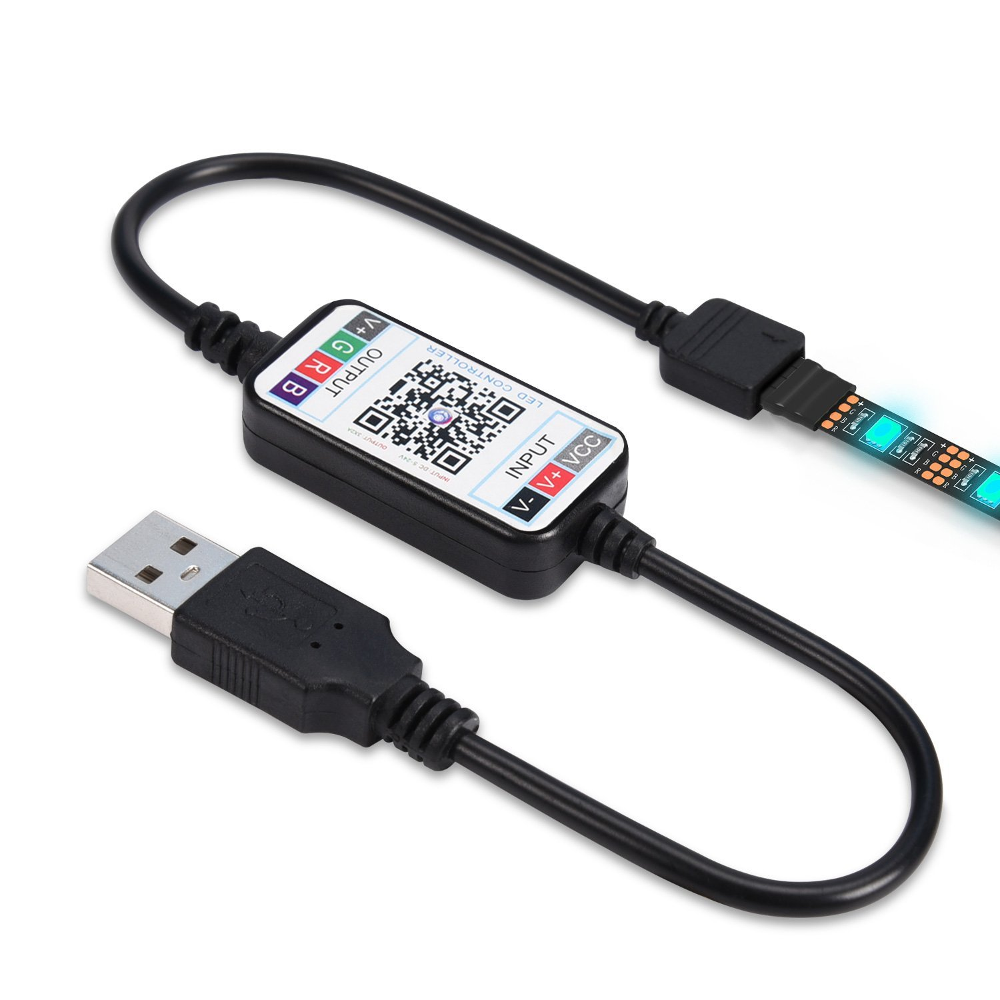


After skimming through the user reviews, the [app](http://www.hao2b.cn/69605) that controls the RGB Strip is hot garbage:


An _average_ of only `3.2` with over `150` verified reviews… the hallmarks of a quality product 🙄.


##### Terrible app with a clunky interface.


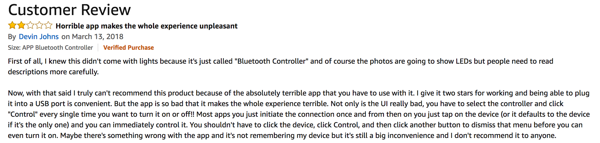

(from: [Horrible app makes the whole experience unpleasant](https://www.amazon.com/gp/customer-reviews/R3C4NWKSPY1KE3))


##### Advertisements on launch

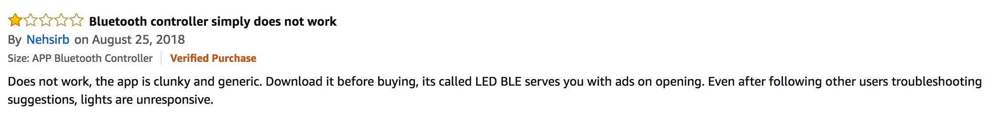

(from: [Bluetooth controller simply does not work](https://www.amazon.com/gp/customer-reviews/R20WKTL056JPT8) )

##### Controller DRM

Apparently, low cost commodity electronics are prone to counterfeits and clones, and the makers have implemented some vague authenticity verification. Some reviews mention something that resembles DRM / controller authentication that may be triggering with false-positives:


(from: [DO NOT BUY IT, SCAM!](https://www.amazon.com/gp/customer-reviews/RKERN2BVFR3Y5))


#### brief overview of the hardware

The internals are pretty basic; a USB power lead, some passive components to control the current for the LEDs and a BTLE SoC on its own board.


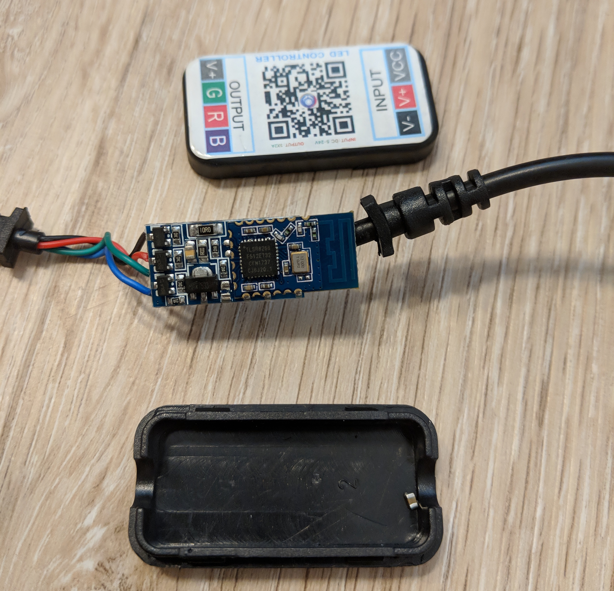

Note the SMD resistor (right side of black enclosure body) that fell off after opening the case.


Front:

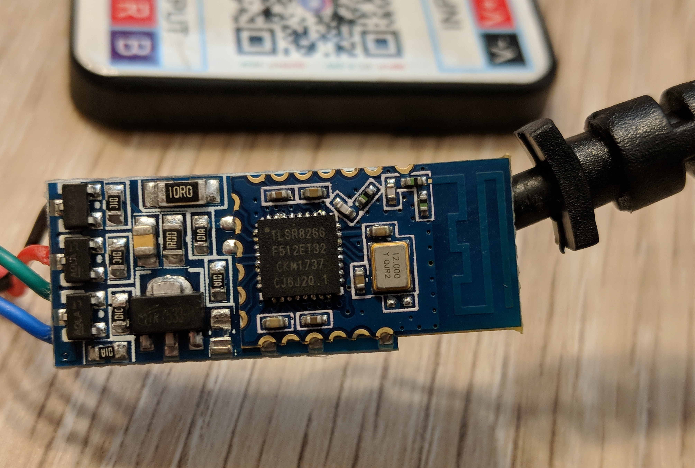

Full Chip Markings:

```
TLSR8266
F512ET32
CKM1737
CJ6J20.1
```


Back:

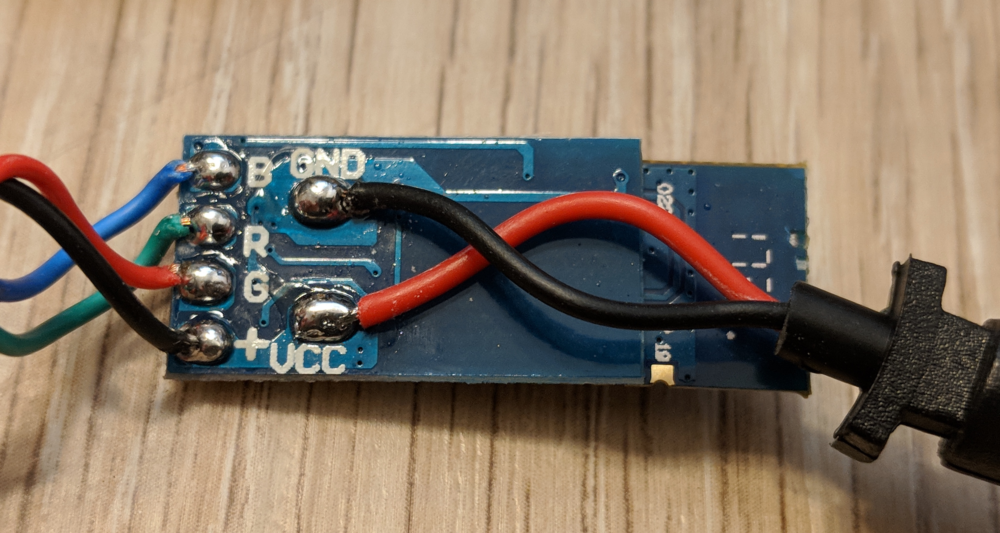


Notice the `R` and `G` contacts have the `G` and `R` wires swapped. 

Side:

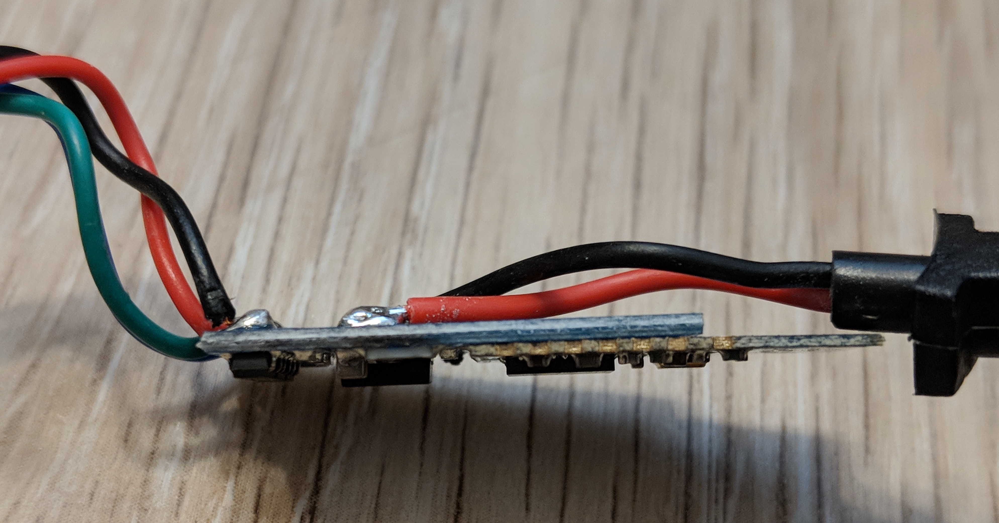


Underside of SOC:


Pins:

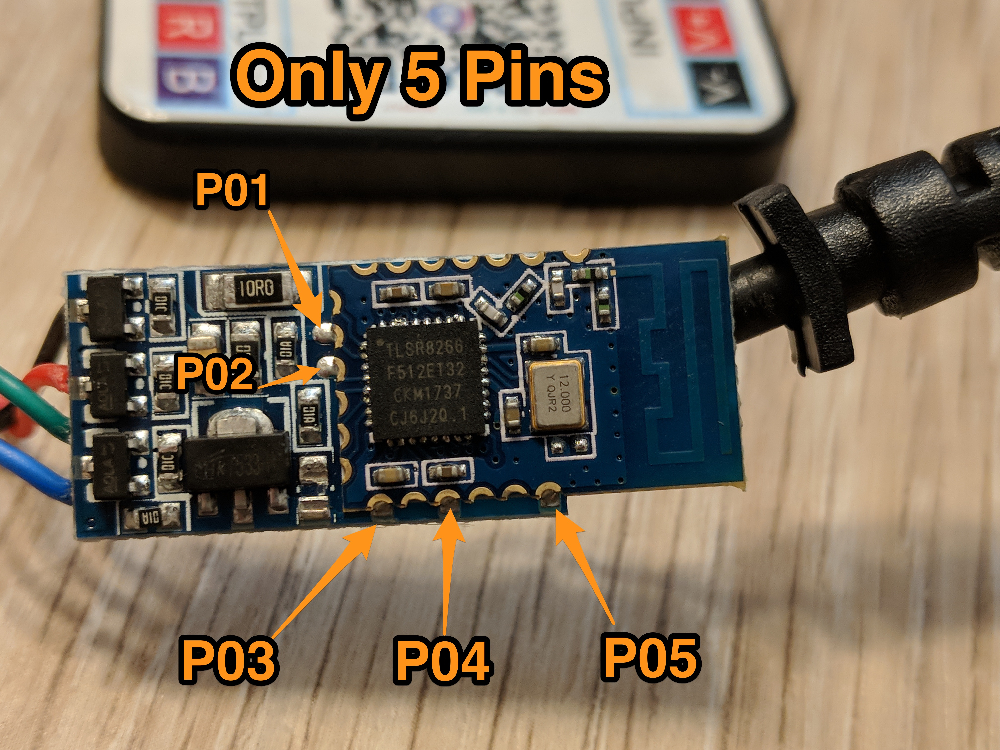


At the time I wrote this up, I did not have access to even a basic DMM to confirm the pin map. And unfortunately, this post sat in a `Drafts` folder  until long after giving the BTLED controller away; I can’t check the mappings above. What you see is from me eyeballing the circuit:

```
P01 - GREEN?
P02 - RED?
P03 - VCC
P04 - BLUE?
P05 - GND
```


##### SoC:

The SoC is a [Telink TLSR8266](http://www.telink-semi.com/archives/applications/8266). The data-sheet is available [here](https://www.obddiag.net/images/ble/Telink_TLSR8266F512-datasheet.pdf) and a copy is also available in the [repo](Telink_TLSR8266F512-datasheet.pdf)

Telink does not seem to provide a SDK to the public, but I may have found an outdated copy [here](https://github.com/jpmorrison/ble_lt_sdk/tree/master/8266_ble_remote) and [here](https://github.com/OnTheWayJohn/ble_lt_sdk).


##### TLSR266 Key Features

To save you a [click](http://www.telink-semi.com/archives/applications/8266), here’s the relevant bits from the manufacturer provided specs:

```
General features
- 32bit high performance MCU, up to 48MHz

A rich set of I/Os:
- Up to 6 channels of PWM
- Embeds hardware AES

RF features:

- BLE/2.4GHz RF transceiver, working in worldwide 2.4GHz ISM band
- Bluetooth 4.2 Compliant, 1Mbps and 2.4GHz 2Mbps Boost Mode
```


### Looking at the Android App

I had a rather limited time frame and no tools other than a screwdriver and laptop available to me at the time, so I focused on reversing the Android app and not the controller firmware.

Just getting the app was [an adventure](A_closer_look_at_obtaining_the_APK.md) in it’s self, but I can confirm that the app really is as bad as the [reviews](#brief-examination-of-product-/-amazon-reviews) make it out to be.


#### poor UX:

##### no notch support

It’s very difficult to use an app when UX elements have their positions hard-coded to a portion of screen that is obscured.

Switching the controller Mode is difficult:

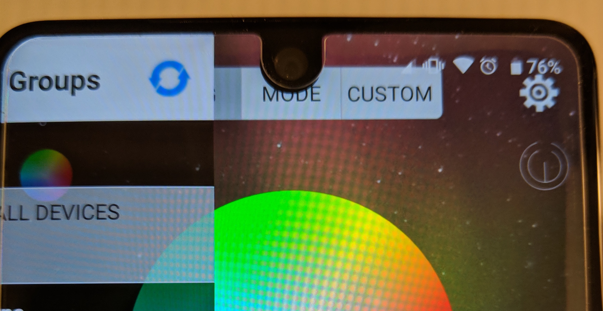


As is refreshing the list of available Controllers:

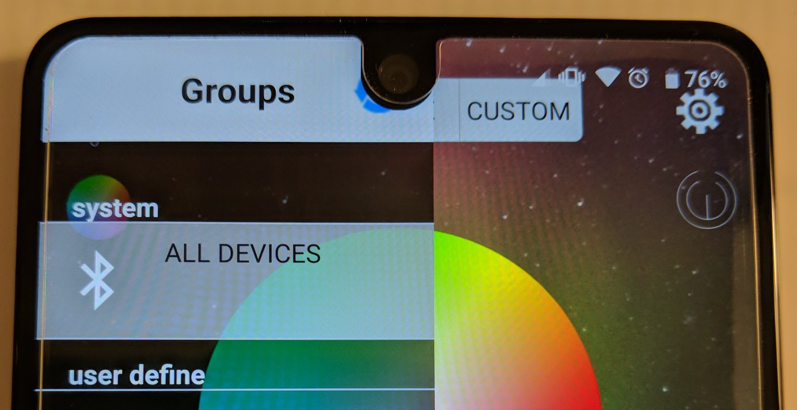

If you bring your finger in from an angle, it's not that difficult to register a press on the "refresh" icon 🙃.


##### advertisements on launch

As mentioned in some of the reviews, [adverts are sometimes shown on launch](#Adverts-on-launch):

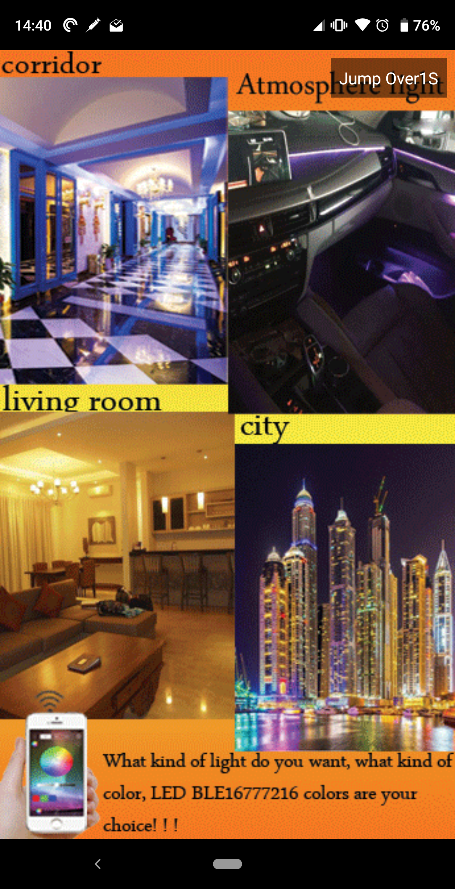

The advert is served from a hard-coded IP address:

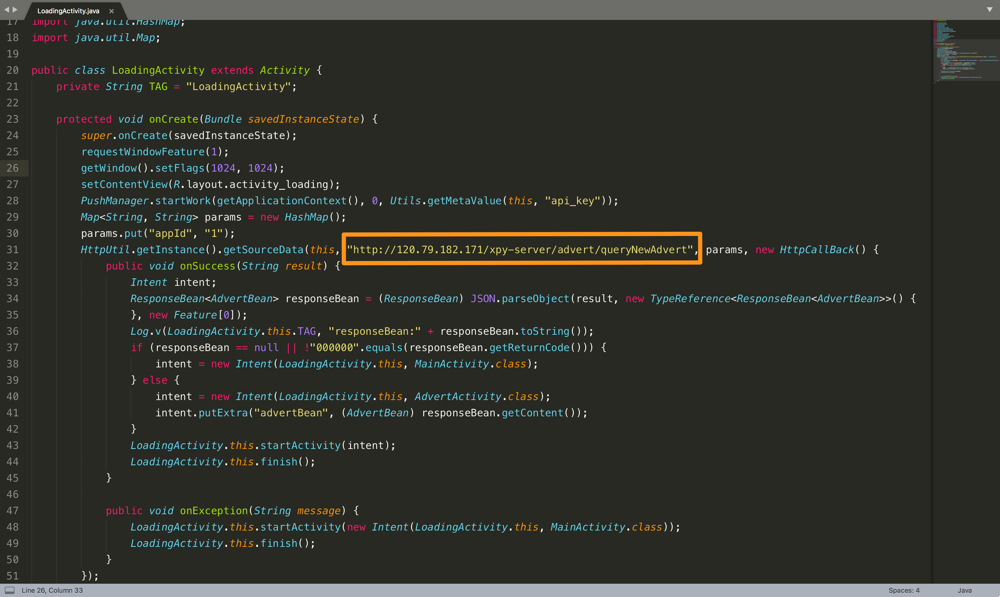


Digging a bit deeper:

```
 
$ curl -vvv -s 'http://120.79.182.171/xpy-server/advert/queryNewAdvert?appId=1'
*   Trying 120.79.182.171...
* TCP_NODELAY set
* Connected to 120.79.182.171 (120.79.182.171) port 80 (#0)
> GET /xpy-server/advert/queryNewAdvert?appId=1 HTTP/1.1
> Host: 120.79.182.171
> User-Agent: curl/7.54.0
> Accept: */*
>
< HTTP/1.1 200 OK
< Server: Apache-Coyote/1.1
< Pragma: no-cache
< Cache-Control: no-cache
< Expires: Thu, 01 Jan 1970 00:00:00 GMT
< Content-Type: application/json;charset=utf-8
< Transfer-Encoding: chunked
< Date: Sat, 08 Sep 2018 17:39:10 GMT
<
* Connection #0 to host 120.79.182.171 left intact
{"content":{"advertId":12,"advertUrl":"2018-9-1","appId":1,"describe":"2018-9-1","imageVisitUrl":"http://120.79.182.171/upload/advert/2018-9-1.png"},"returnCode":"000000","returnDesc":"success"}⏎
```

The relevant bit:

```
{
  "content": {
    "advertId": 12,
    "advertUrl": "2018-9-1",
    "appId": 1,
    "describe": "2018-9-1",
    "imageVisitUrl": "http://120.79.182.171/upload/advert/2018-9-1.png"
  },
  "returnCode": "000000",
  "returnDesc": "success"
}

```

What advert are we going to see?

```
$ curl http://120.79.182.171/upload/advert/2018-9-1.png --output advert.png

$ file advert.png
advert.png: PNG image data, 345 x 613, 8-bit colormap, non-interlaced
```


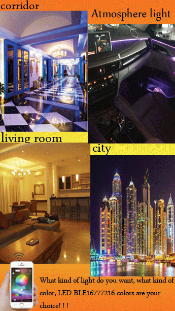


Huh, that looks familiar.

##### un-necessary dependencies

The decompiled APK seems to have several libraries and dependencies bundled that don't seem relevant to the app's primary purpose; control an RGB Strip.

###### push notifications and analytics

In addition to adverts on launch, the app seems to have faculties for sending me PUSH notifications:


And it wouldn’t be 2018 without a needless phone home beacon:

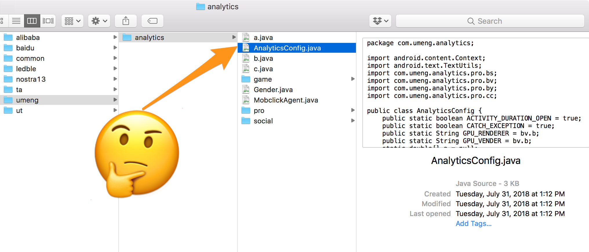


### Dumping Packets

Fortunately, Android makes it very easy to [dump every BTLE packet](http://blog.bluetooth.com/debugging-bluetooth-with-an-android-app) that the phone sees.

Using the absolutely amazing [nRF Toolbox](https://play.google.com/store/apps/details?id=no.nordicsemi.android.nrftoolbox&hl=en), I was able to probe the various services and characteristics advertised by the controller. These two incredibly helpful guides helped me make sense of exactly what I was seeing in the capture:

1. [How To Use Android BLE to Communicate with Bluetooth Devices - An Overview & Code examples](https://medium.com/@avigezerit/bluetooth-low-energy-on-android-22bc7310387a)
2. [This Is Not a Post About BLE, Introducing BLEAH](https://www.evilsocket.net/2017/09/23/This-is-not-a-post-about-BLE-introducing-BLEAH/)


While I am grateful for the ease of dumping the entire conversation between the app and controller, it’s incredibly difficult to correlate an exact action taken in the UI with an exact packet. I limited packet captures to only when the Controller app was in the foreground, but quickly amassed over 22,000 packets. Even after filtering out only the packets instructing the controller to do something, I was left with over 200 packets:

```
# the target controller mac
bluetooth.addr==78:9c:e7:01:5a:31 

# the "write to endpoint" flag
btatt.opcode.method==0x12
```

200 packets is still too many to directly correlate to any specific action take in the app, but after starting at things for long enough, a simple pattern did emerge:

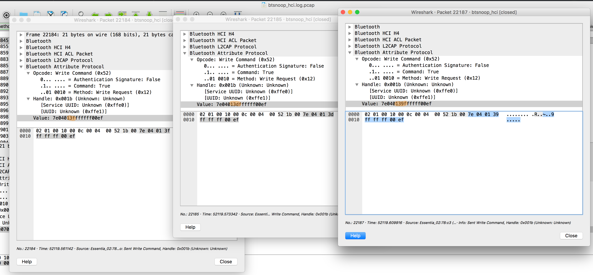

Three sequential packets from a capture where i did nothing but adjusting the amount of red color. All bytes but one are the same; a single unsigned 8 bit number used to represent the brightness slider scale value…🤔.


| Packet | 0x0 | 0x1 | 0x2 | 0x3 | 0x4 | 0x5 | 0x6 | 0x7 | 0x8 |
| ------ | --- | --- | --- | --- | --- | --- | --- | --- | --- |
| 184    | 7e  | 04  | 01  | 3f  | ff  | ff  | ff  | 00  | ef  |
| 185    | 7e  | 04  | 01  | 3d  | ff  | ff  | ff  | 00  | ef  |
| 187    | 7e  | 04  | 01  | 39  | ff  | ff  | ff  | 00  | ef  |

One byte is decreasing at a small predictable rate... which is the only thing i did in the app for this capture. 

Jackpot! ...Probably.

Unobfuscated packets and a single unsigned byte per color channel is promising, but decompiling the java code from the APK is the only way to be sure…

##### What i found: 


Turns out, it really is that simple! Here’s the code that generates the 9 bytes needed to set the controller to an arbitrary RGB value.

```
    public int[] setRGB(int red, int green, int blue) {
        Log.i(TAG, "setRGB> red: " + red + " green:" + green + " blue:" +blue);

        int[] bytes = new int[9];

        bytes[0] = 126;
        bytes[1] = 7;
        bytes[2] = 5;
        bytes[3] = 3;
        ///TODO make sure you fire off setRGBOrder(1) first!/
        bytes[4] = red;
        bytes[5] = blue;
        bytes[6] = green;
        bytes[8] = 239;

        return bytes;
    }

```

I did only enough reverse engineering to figure out the basics. The "presentable" bits of my notes are in [`Magic_numbers.md`](Magic_numbers.md)


### an APK

I “borrowed” an Android Developer BTLE [demo application](https://github.com/googlesamples/android-BluetoothLeGatt) and hacked in just enough of my own code to get a proof of concept APK built. There are rough edges, but this app can issue basic commands to the led controller.

Implemented:
- scan for nearby BTLE devices; display only the `LED-*` devices
- set brightness, RGB value of controller
- assign the `R`, `G`, `B` colors to the 1,2,3 PWM channel
- toggling the built in macros

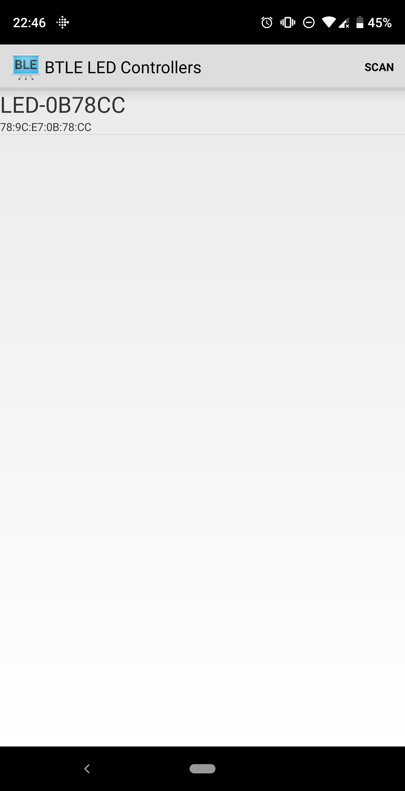

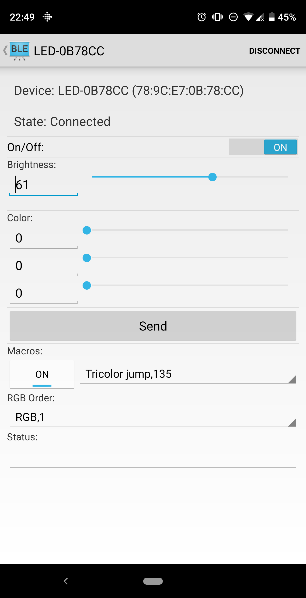

**Note:** I am not a professional android developer, and I needed this app to work for me on my [device](https://www.gsmarena.com/_essential_ph_1-8710.php). I accomplished that and am now (after significant delay!) moving on. I am providing my test app as is with no support in the hope that this will save you from the terrible manufacturer provided app or give you enough documentation to build your own app.

I hope it’s useful to you. Beyond what documentation I’ve posted here and in the code, I can’t help you.


The bare-bones replacement apk can be downloaded here:

- [`com.karlquinsland.android.btleled.apk (df1e61946eef652e01a5c0a5c94dee85fd0091e3)`](com.karlquinsland.android.btleled.apk)

And the source code that "drives" the APK can be found in [`ControllerDriverClass.java`](/files/src/main/java/com/karlquinsland/android/btleled/ControllerDriverClass.java)


### invitation to have others hack around 


The [SoC](#soc) is pretty powerful for something that only costs $5 US and includes a USB power supply circuit. Who knows what else is in there!? I’d love to see what’s going over the `RX/TX` pins 🧐.

If you have a good electronics setup and some spare time, please dump the firmware and let me know what you find!
